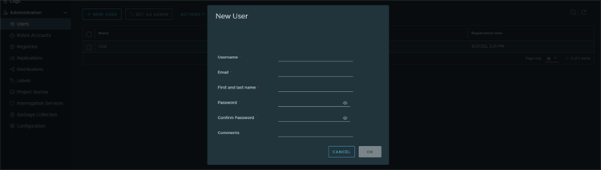
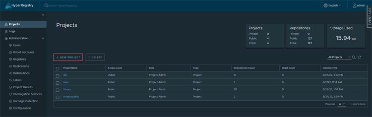
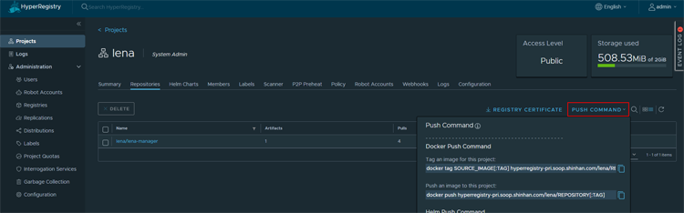
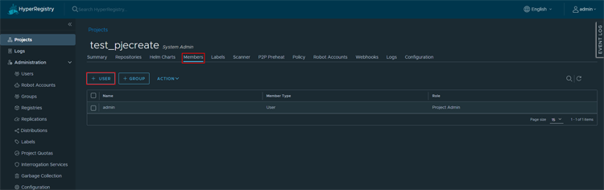
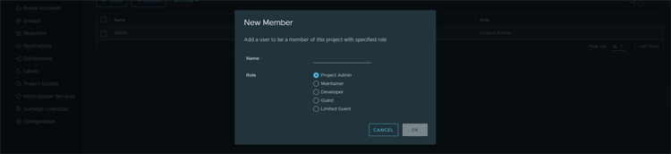

= 컨테이너 이미지 관리
:toc:
:toc-title:

== HyperRegistry

=== 개요
HyperCloud에는 다음과 같이 두 개의 레지스트리가 존재한다.
[width="100%",options="header", cols="1,2"]
|====================
|레지스트리|설명
|HyperRegistry|HyperCloud에 필요한 이미지와 CI/CD 파이프라인에서 생성되는 컨테이너 이미지를 보관한다.
|Master|Master 노드에 컨테이너로 구성된 레지스트리로, HyperCloud 설치 과정에 필요한 이미지를 보관한다.
|====================

HyperRegistry에서는 액세스 레벨을 이용하여 저장된 이미지에 대한 접근을 제어한다. 이때 크게 익명 사용자와 프로젝트 멤버로 구분할 수 있고, 프로젝트 생성 시 Public 또는 Private으로 액세스 레벨을 설정할 수 있다. +
다음은 익명 사용자 및 프로젝트 개발자를 기준으로 Public/Private에 따른 Pull/Push 권한의 부여 여부이다.
[width="100%",options="header", cols="1,1,1,1"]
|====================
|사용자 구분|권한|Public|Private
1.2+|익명 사용자|Pull(Read)|O|X
|Push(Write)|X|X
1.2+|프로젝트 개발자|Pull(Read)|O|O
|Push(Write)|O|O
|====================

=== 계정 생성 
클러스터 관리자는 임의의 사용자를 직접 등록할 수 있다.

. HyperRegistry 콘솔에서 *[Administration] > [Users]* 메뉴를 선택한다.
. *Users* 화면이 열리면 *[+ NEW USER]* 버튼을 클릭한다.
+
image::../images/figure_hyperregistry_new_user.png[]
. *New User* 팝업이 열리면 생성할 사용자의 정보를 설정한 후 *[OK]* 버튼을 클릭한다.
+

+
각 설정 항목에 대한 설명은 다음과 같다. (* : 필수 설정 항목)
+
[width="100%",options="header", cols="1,2a"]
|====================
|항목|설명
|Username *|사용자의 이름을 입력한다. 단, hyperregistry 시스템 내에서 고유해야 한다.
|Email *|사용자의 이메일 주소를 입력한다. 단, hyperregistry 시스템 내에서 고유해야 한다.
|First and last name *|이름과 성을 입력한다.
|Password *|사용자의 비밀번호를 입력한다. 

이때 입력 조건은 다음과 같다.

* 총 8글자 이상
* 대문자, 소문자, 숫자를 포함
|Confirm Password *|확인을 위해 *'Password'* 항목에 입력한 내용을 동일하게 입력한다.
|Comments|사용자에 대한 간략한 설명을 입력한다.
|====================

=== 프로젝트 생성
새로운 프로젝트를 생성한다.

. HyperRegistry 콘솔에서 *[Projects]* 메뉴를 선택한다.
. *Projects* 화면이 열리면 *[+ NEW PROJECT]* 버튼을 클릭한다.
+

. *New Project* 팝업이 열리면 생성할 프로젝트의 정보를 설정한 후 *[OK]* 버튼을 클릭한다.
+
image::../../images/figure_hyperregistry_new_project_popup.png[]
+
각 설정 항목에 대한 설명은 다음과 같다. (* : 필수 설정 항목)
+
[width="100%",options="header", cols="1,2a"]
|====================
|항목|설명
|Project Name *|프로젝트의 이름을 입력한다.

이때 입력 조건은 다음과 같다.

* 최소 1자, 최대 255자
* 영문 소문자, 숫자, 특수기호(._-)만 사용 가능
* 문자나 숫자로 시작

|Access Level|공개 설정 유무를 설정한다.
|Storage Quota *|스토리지 용량을 입력한다.
|Proxy Cache|외부 레지스트리와 연동 유무를 설정한다.
|====================

[NOTE]
====
생성된 프로젝트의 이름을 클릭한 후 *[Repositories]* 탭에서 
우측의 *[PUSH COMMAND]*를 클릭하면 해당 프로젝트에 이미지를 Push하기 위한 명령을 확인할 수 있다.

====

=== 프로젝트 멤버 관리
프로젝트에 새로운 멤버를 추가한다.

. HyperRegistry 콘솔에서 *[Projects]* 메뉴를 선택한다.
. *Projects* 화면이 열리면 멤버를 추가할 프로젝트의 이름을 클릭한다.
. 해당 프로젝트의 상세 화면이 열리면 *[Members]* 탭에서 *[+ USER]* 버튼을 클릭한다.
+

. *New Member* 팝업이 열리면 추가할 멤버의 정보를 설정한 후 *[OK]* 버튼을 클릭한다.
+

+
각 설정 항목에 대한 설명은 다음과 같다. (* : 필수 설정 항목)
+
[width="100%",options="header", cols="1,2a"]
|====================
|항목|설명
|Name *|멤버로 추가할 사용자의 이름을 입력한다.
|Role|멤버로 추가할 사용자의 역할을 선택한다.

* Project Admin
* Maintainer
* Developer
* Guest
* Limited Guest

각 역할별로 수행 가능한 동작은 아래의 표 [역할별 권한]을 참고한다.
|====================
+
.[역할별 권한]
[caption=]
[width="100%",options="header", cols="2,^1,^1,^1,^1,^1"]
|====================
|권한 \ 역할|Limited Guest|Guest|Developer|Maintainer|Project Admin
|프로젝트 구성 보기|∨|∨|∨|∨|∨
|프로젝트 구성 편집|||||∨
|프로젝트 구성원 목록 보기||∨|∨|∨|∨
|프로젝트 구성원 생성/수정/삭제|||||∨
|프로젝트 로그 목록 보기||∨|∨|∨|∨
|프로젝트 복제 목록 보기||||∨|∨
|프로젝트 복제 작업 목록 보기|||||∨
|프로젝트 레이블 목록 보기||||∨|∨
|프로젝트 라벨 생성/수정/삭제||||∨|∨
|저장소 목록 보기|∨|∨|∨|∨|∨
|저장소 생성|||∨|∨|∨
|저장소 편집/삭제||||∨|∨
|이미지 목록 보기|∨|∨|∨|∨|∨
|이미지 태그 다시 지정||∨|∨|∨|∨
|이미지 가져오기|∨|∨|∨|∨|∨
|이미지 내보기기|||∨|∨|∨
|이미지 스캔/삭제||||∨|∨
|==================== 

== 이미지 관리
원하는 기능의 컨테이너 이미지를 CRI-O와 같은 Container Runtime 환경에서 가져다 쓸 수 있도록 이미지 레지스트리에서 관리할 수 있다.

=== 이미지 로드
외부망 사용이 가능한 환경일 경우 `podman pull` 명령을 통해 바로 Docker Hub에서 이미지를 가져오면 되지만 폐쇄망에서는 이 같은 방법이 불가능하다. +
따라서 폐쇄망 환경에서는 이미지 로드 과정이 필요하다. 이미지를 'tar' 또는 'gz' 형식의 파일로 저장하고, 이를 작업 환경으로 옮겨 로드한 후 사용해야 한다.

. 'tar' 또는 'gz' 형식으로 된 이미지 파일을 Podman 환경으로 옮긴다.

. `podman load -i [파일 이름].[확장자]` 명령을 사용하여 이미지 파일을 로드한다.
+
.예시
----
$ podman load -i tomcat.tar
----

=== 이미지 태그
로드한 이미지는 이미지 레지스트리에 푸시(Push)한 후 사용할 수 있다. 단, 이미지 레지스트리에 이미지를 푸시하기 위해서는 레지스트리 주소가 포함된 이름으로 태그를 지정해야 한다.

`podman tag [이미지 이름]:[태그 이름] [레지스트리 IP 주소]:[레지스트리 포트 번호]/[이미지 이름]:[태그 이름]` 명령을 사용하여 로드한 이미지에 태그를 생성한다. 이때 태그 이름을 버전으로 명시하면 관리에 용이하다.

.예시
----
$ podman tag docker.io/library/busybox:1.28 30.0.0.1:5000/docker.io/library/busybox:1.28
----

CAUTION: 태그를 지정하지 않을 경우 해당 이미지를 푸시할 수 없기 때문에 사용이 불가능하다.

=== 이미지 푸시
태그를 생성한 이미지를 사용하기 위해서는 해당 이미지를 푸시하여 레지스트리에 추가해야 한다.

`podman push [레지스트리 IP 주소]:[레지스트리 포트 번호]/[이미지 이름]:[태그 이름]` 명령을 사용하여 사용할 이미지를 레지스트리에 푸시한다.

.예시
----
$ podman push 30.0.0.1:5000/docker.io/library/busybox:1.28
----

이미지 푸시가 정상적으로 완료되며 해당 이미지를 이용하여 컨테이너를 생성할 수 있다.

=== 이미지 삭제

장기간 운영을 하다 보면 더 이상 사용하지 않는 이미지가 쌓이기 시작한다. 불필요한 용량 사용과 관리의 번거로움을 해소하기 위해 사용하지 않는 이미지를 삭제한다.

==== [HyperRegistry의 이미지 삭제]

다음은 HyperRegistry 콘솔에서 이미지를 삭제하는 방법에 대한 설명이다.

. HyperRegistry 콘솔에서 [Projects] 메뉴를 선택한다.
. Projects 화면이 열리면 프로젝트의 이름을 클릭한다.
. 해당 프로젝트의 상세 화면이 열리면 *[Repositories]* 탭에서 삭제할 이미지가 저장된 리포지터리의 이름을 클릭한다.
. 해당 리포지터리의 상세 화면이 열리면 *[Artifacts]* 탭에서 삭제할 이미지의 체크박스를 선택한다.
. *[ACTIONS]* 메뉴에서 **[Delete]**를 선택한다. 

==== [Docker 레지스트리의 이미지 삭제]

다음은 Docker 레지스트리에서 이미지를 삭제하는 방법에 대한 설명이다.

. `podman exec -it [컨테이너 ID] sh` 명령을 사용하여 삭제할 이미지가 저장된 Podman 레지스트리 컨테이너에 접속한다.
+
.예시
----
$ podman exec -it 123456789abc sh /
----
. 컨테이너에 접속 후 `/var/lib/registry/podman/registry/v2/repositories` 경로로 이동하면 레지스트리에 추가되어 있는 이미지를 확인할 수 있다.
+
----
$ cd /var/lib/registry/podman/registry/v2/repositories 
----
. `rm -rf [이미지 이름]` 명령을 사용하여 이미지를 삭제한다.
+
.예시 - tomcat 이미지 삭제
----
$ rm –rf tomcat
----
. Garbage Collection을 수행하여 불필요한 메모리를 정리한다.
+
----
$ /bin/registry garbage-collect /etc/podman/registry/config.yaml
----
. 컨테이너 접속을 종료한다.
+
----
$ exit
----
. `podman restart [컨테이너 ID]` 명령을 사용하여 Podman 컨테이너를 재기동한다.
+
.예시
----
$ podman restart 123456789abc
----

== 노드 이미지 관리

HyperCloud에서 사용하는 컨테이너 런타임 인터페이스는 CRI-O이다. CRI-O를 통해 노드에 파드가 배포되면 파드에서 사용하는 컨테이너 이미지를 해당 노드에서 가져오게 된다. 이때 버전이 변경됨에 따라 사용하지 않는 이미지들이 노드에 쌓이게 되는데 디스크 공간을 효율적으로 사용하기 위해 주기적으로 삭제해야 한다.

다음은 이미지 관리를 위한 `crictl` 명령어의 사용 방법에 대해서 설명한다.

* *노드의 실행 파드 조회* +
배포되는 파드는 루트(root) 계정으로 실행되기 때문에 루트 권한으로 조회한다.
+
----
$ sudo /usr/local/bin/crictl ps
----
* *노드의 이미지 조회* +
파드를 생성하기 위해 사용하거나 사용했던 이미지를 조회한다.
+
----
$ sudo /usr/local/bin/crictl images
----

* *노드의 이미지 삭제* +
노드에서 사용하지 않는 이미지를 삭제한다.
+
----
$sudo /usr/local/bin/crictl rmi -q
----
+
해당 명령의 옵션 정보는 다음과 같다.
+
[width="100%",options="header", cols="1,2"]
|====================
|옵션|설명
|--all, -a|모든 이미지를 삭제한다.
|--prune, -q|사용하지 않는 이미지만 삭제한다.
|====================
