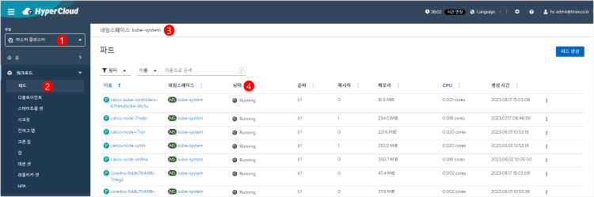

= 파드 점검
:toc:
:toc-title:

== kube-system 파드 점검

k8s를 구성하는 static pod이며, k8s가 정상적으로 기동되기 위해서 필수적으로 필요한 파드들로 점검이 필요하다. +
해당 파드들 중 하나라도 이상이 있을 경우 클러스터는 정상적으로 일을 수행할 수 없다.

<1> "마스터 클러스터" 콘솔 선택
<2> *[워크로드] > [파드]* 메뉴 클릭
<3> "kube-system" 네임스페이스 선택
<4> 조회된 파드들의 상태가 모두 "Running" 인지 확인

NOTE: CLI 환경에서는 `kubectl get pods -n kube-system` 명령을 사용하여 kube-system 파드 상태를 조회할 수 있다.

== HyperCloud 파드 점검

HyperCloud가 정상적으로 기동되기 위해서 필요한 파드들로 이중 하나라도 이상이 있을 경우 HyperCloud는 정상적인 동작을 하지 않는다.

(TD: hypercloud5-system 네임스페이스가 선택된 화면 캡처 필요)

<1> "마스터 클러스터" 콘솔 선택
<2> *[워크로드] > [파드]* 메뉴 클릭
<3> "hypercloud5-system", "console-system", "hyperauth" 네임스페이스를 각각 선택
<4> 조회된 파드들의 상태가 모두 "Running" 인지 확인

== 기타 파드 점검

k8s와 HyperCloud 이외에 사용자가 올린 서비스들의 상태를 점검한다.

(TD: 기타 네임스페이스가 선택된 화면 캡처 필요)

<1> "마스터 클러스터" 콘솔 선택
<2> *[워크로드] > [파드]* 메뉴 클릭
<3> k8s 및 HyperCloud 파드 관련 외의 네임스페이스를 각각 선택
<4> 조회된 파드들의 상태가 모두 "Running" 인지 확인
