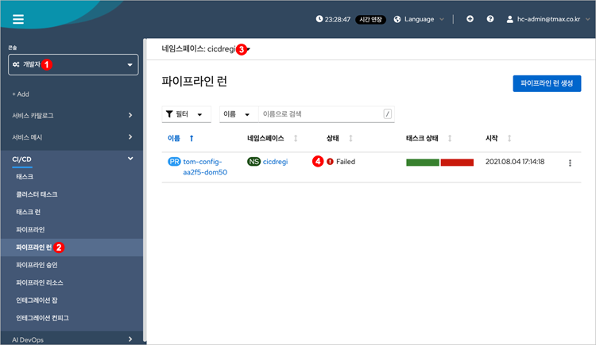
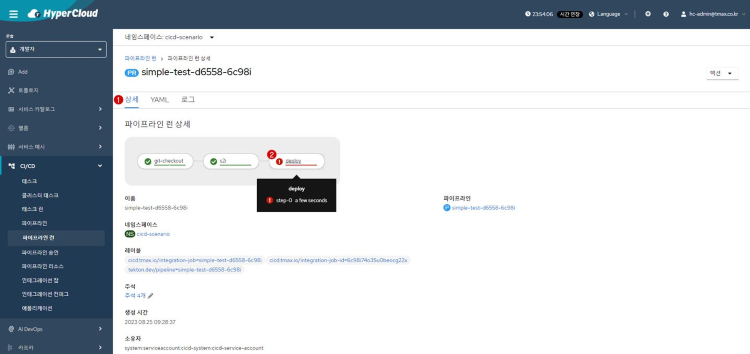
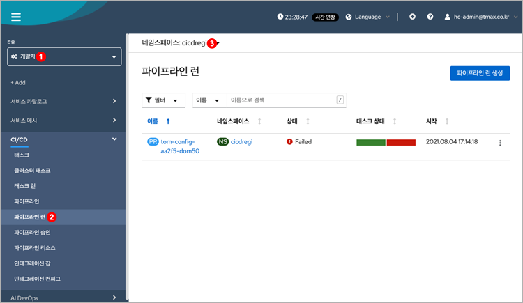

= 동작 상태와 이력 확인
:toc:
:toc-title:

== 파이프라인의 동작 상태 조회

HyperCloud는 현재 진행 중인 CI/CD의 각 단계(태스크)에 대한 진행 상황을 한눈에 파악할 수 있으며, 오류가 발생할 경우 어느 단계에서 문제가 발생하였는지 확인하기가 간편하다.

. *파이프라인 런 목록 조회 및 상태 확인* +
파이프라인 런 목록을 조회하여 수행 상태를 확인한다.
+

<1> "개발자" 콘솔 선택
<2> *[CI/CD] > [파이프라인 런]* 메뉴 클릭
<3> 조회할 파이프라인이 생성되어 있는 네임스페이스를 선택
<4> 조회된 파이프라인 런 목록의 "상태" 항목에서 진행 상태 확인

. *파이프라인 런 상세 정보 확인* +
파이프라인 런 목록에서 상세 정보를 확인할 파이프라인 런의 이름을 클릭한다. +
이때 해당 파이프라인 런의 상세 화면이 열리면 *[상세]* 탭에서 각 단계별 수행 상태를 상세하게 확인할 수 있다.
+

<1> *[상세]* 탭 선택
<2> 파이프라인 런이 정상적으로 수행되지 않을 경우 어느 단계에서 문제가 발생하였는지 확인 가능

== 파이프라인의 로그 조회

파이프라인 동작에 대한 로그를 확인한다.

. *파이프라인 런 목록 조회* +
로그를 확인할 파이프라인 런 목록을 조회한다.
+

<1> "개발자" 콘솔 선택
<2> *[CI/CD] > [파이프라인 런]* 메뉴 클릭
<3> 조회할 파이프라인이 생성되어 있는 네임스페이스를 선택

. *파이프라인 런 상세 정보 확인* +
파이프라인 런 목록에서 로그를 확인할 파이프라인 런의 이름을 클릭한다. +
이때 해당 파이프라인 런의 상세 화면이 열리면 *[로그]* 탭에서 로그 내용을 확인할 수 있다.
+
image::../../images/figure_pipelinerun_detail_log.png[]
<1> *[로그]* 탭 선택
<2> 각 단계를 클릭하여 해당 단계의 로그 내용을 확인

== 파이프라인의 파드 오류 확인

파이프라인 신규 구성 및 수정에서 파이프라인이 동작하지 않거나 비정상 종료될 경우 파이프라인 관련 정보를 조회하거나 실행했던 파드의 상세 정보를 조회할 수 있다. +
HyperCloud에서의 CI/CD 파이프라인은 IntegrationConfig, IntegrationJob, Task, Pipeline Run, Pod 정도의 개체에서 동작 내용을 확인한다.

NOTE: IntegrationConfig는 파이프라인을 정의한 것이다. 파이프라인은 Job으로 구성되며, Job은 Task를 참조할 수 있다. +
파이프라인 구동은 cicd-operator가 Gitea 또는 GitLab에서 발생한 이벤트를 받아 해당 IntegrationConfig를 이용하여 IntegrationJob을 생성한다. +
이때 IntegrationJob에 의해 Pipeline Run이 생성되고 Pipeline Run에서 Job에 해당하는 Pod를 생성하여 Job 업무를 처리하게 된다. +
로그를 조회하는 순서도 위와 같은 순서로 진행한다.

다음은 CLI 환경에서 로그를 확인하는 과정이다.

. *IntegrationConfig 상태 확인*
+
.예시
----
$ kubectl -n dls-cicd-private-dev get ic

NAME                       READY   WEBHOOKREGISTERED   AGE
dls-mcl-cab-dev-ic01       True    True                33d
dls-mcl-cab-dev-ic02       False   True                33d
dls-mcl-car-dev-ic01       True    True                33d
dls-mcl-car-dev-ic02       True    True                33d
----
+
만약 IntegrationConfig가 오류 상태일 경우 describe 정보에서 status 내용을 확인한다.
+
.예시
----
$ kubectl -n dls-cicd-private-dev describe ic dls-mcl-car-dev-ic02

Name:         dls-mcl-car-dev-ic02
Namespace:    dls-cicd-private-dev
Labels:       <none>
...
중략
...
Status:                                                
  Conditions:
    Last Transition Time:  2022-06-21T10:56:36Z
    Message:               Secret "secret" is invalid: type: Invalid value: "kubernetes.io/basic-auth": field is immutable
    Status:                False
    Type:                  ready
    Last Transition Time:  2022-06-21T10:56:36Z
    Status:                True
    Type:                  webhook-registered
  Secrets:                 r9ormm3mmbjs1d6tz77s
Events:                    <none>
----

. *IntegrationJob 상태 확인*
+
.예시
----
$ kubectl -n dls-cicd-private-dev get ij 

NAME                               STATE    STARTTIME   COMPLETIONTIME   AGE
version-tst-dls-ic01-00000-72of3   Failed   120m        60m              120m
version-tst-dls-ic01-1fd1f-2wldk   Failed   6h8m        6h8m             6h8m
version-tst-dls-ic01-b2640-3zxg7   Failed   5h37m       5h37m            5h37m
----
+
만약 IntegrationJob이 오류 상태일 경우 describe 정보에서 status 내용을 확인한다.
+
.예시
----
$ kubectl -n dls-cicd-private-dev describe ij version-tst-dls-ic01-00000-72of3

Name:         version-tst-dls-ic01-00000-72of3
Namespace:    dls-cicd-private-dev
...
중략
...
Status:
  Completion Time:  2022-07-25T05:44:24Z
  Jobs:
    Completion Time:  2022-07-25T04:44:13Z
    Message:          All Steps have completed executing
    Name:             git-clone
    Pod Name:         version-tst-dls-ic01-00000-72of3-git-clone-4jdtt-pod-dv6m8
    Start Time:       2022-07-25T04:44:05Z
    State:            success
    Completion Time:  2022-07-25T05:44:24Z
    Message:          "step-gradle-build-version-tst" exited with code 1 (image: "xxx.xx.xxx.xx:8443/dls/gradle@sha256:caf876874342abd3094a16364ea354f6492af500bfc4eeae8968ff1f02a94190"); for logs run: kubectl -n dls-cicd-private-dev logs version-tst-dls-ic01-00000-72of3-gradle-build-version-tst-l78l4 -c step-gradle-build-version-tst

    Name:        gradle-build-version-tst
    Pod Name:    version-tst-dls-ic01-00000-72of3-gradle-build-version-tst-l78l4
    Start Time:  2022-07-25T04:44:13Z
    State:       failure
  Message:       Tasks Completed: 2 (Failed: 1, Cancelled 0), Skipped: 0
  Start Time:    2022-07-25T04:44:05Z
  State:         Failed
Events:          <none>
----

. *PipelineRun 상태 확인*
+
.예시
----
$ kubectl -n dls-cicd-private-dev get pipelinerun

NAME                               SUCCEEDED   REASON   STARTTIME   COMPLETIONTIME
version-tst-dls-ic01-00000-72of3   False       Failed   121m        61m
version-tst-dls-ic01-1fd1f-2wldk   False       Failed   6h10m       6h9m
version-tst-dls-ic01-b2640-3zxg7   False       Failed   5h38m       5h38m
----

. *Pod 상태 확인*
+
.예시
----
$ kubectl -n dls-cicd-private-dev get pod --sort-by=.metadata.creationTimestamp

NAME                                                              READY   STATUS             RESTARTS   AGE
echo-taskrun-pod-nhjf9                                            0/1     Completed          0          179d
echo-taskrun3-pod-75cbr                                           0/1     Completed          0          179d
prv-dls-mcl-cicd2-66ffbb7545-nvbb4                                0/1     ImagePullBackOff   0          13d
prv-dls-mcl-cicd-74c7dd64dd-l2ljn                                 0/1     ImagePullBackOff   0          13d
version-tst-dls-ic01-1fd1f-2wldk-git-clone-vx27m-pod-bmm6t        0/1     Completed          0          6h10m
version-tst-dls-ic01-1fd1f-2wldk-gradle-build-version-tst-85czn   0/1     Error              0          6h10m
version-tst-dls-ic01-b2640-3zxg7-git-clone-9c9tm-pod-cjmx4        0/1     Completed          0          5h39m
version-tst-dls-ic01-b2640-3zxg7-gradle-build-version-tst-dqc4v   0/1     Error              0          5h39m
version-tst-dls-ic01-00000-72of3-git-clone-4jdtt-pod-dv6m8        0/1     Completed          0          122m
version-tst-dls-ic01-00000-72of3-gradle-build-version-tst-l78l4   0/1     Error              0          122m
----
+
만약 Pod가 오류 상태일 경우 describe 정보에서 status 내용을 확인한다.
+
.예시
----
$ kubectl -n dls-cicd-private-dev describe pod version-tst-dls-ic01-1fd1f-2wldk-gradle-build-version-tst-85czn
----
