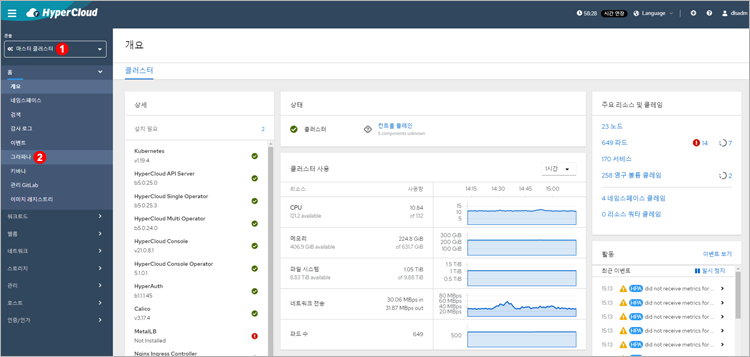
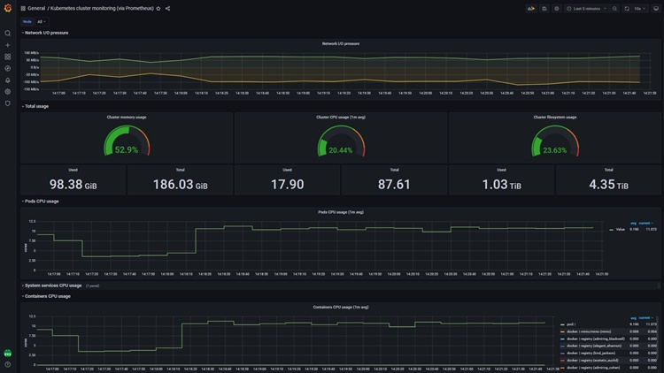
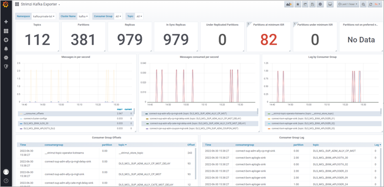
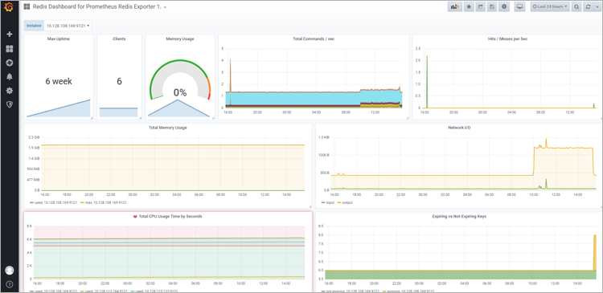
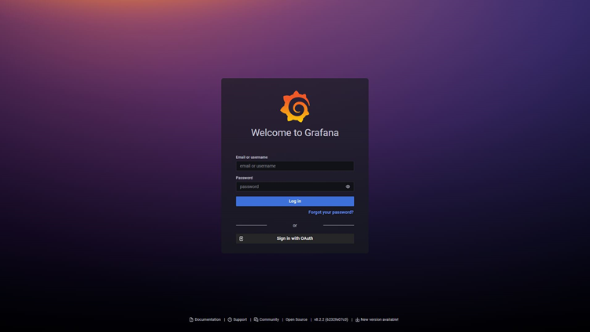
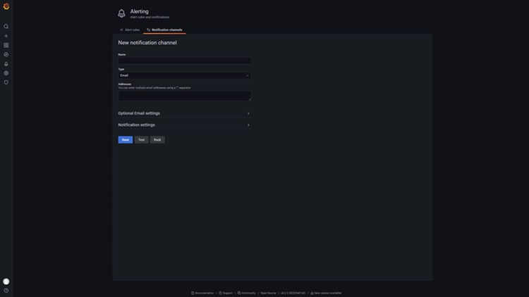
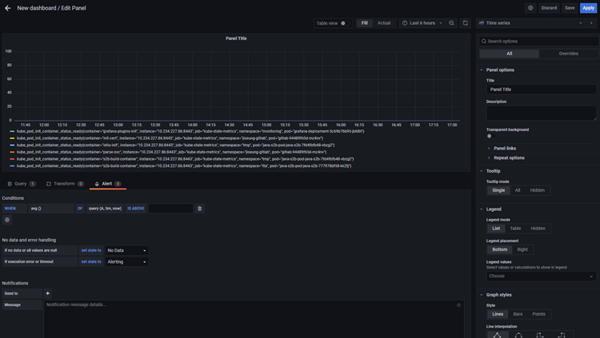

= 그라파나
:toc:
:toc-title:

== 개요
프로메테우스를 통해 수집한 메트릭을 기반으로 그라파나를 통해 시각화하여 자원과 서비스에 대한 모니터링이 가능하다. +
그라파나의 대쉬보드는 커스텀이 가능하기 때문에 사용자가 직접 편의에 맞게 구성이 가능하다. 또한 알람(Alert) 기능을 통해 사용자가 지정한 특정 조건 상황에서 알림을 받을 수 있다.

== 그라파나 실행 및 대시보드 구성
HyperCloud 콘솔을 통해 그라파나를 실행한다.

<1> "마스터 클러스터" 콘솔 선택
<2> *[홈] > [그라파나]* 메뉴 클릭

그라파나 접속 화면이 열리면 상단의 "General / Home" 부분을 클릭하여 생성되어 있는 대쉬보드를 전환할 수 있다. 대쉬보드의 경우 사용자가 직접 커스텀을 하거나 그라파나 홈페이지에서 json 형식으로 받아 import 시키는 방법이 있다. +
그라파나를 통해 노드의 상태, 자원의 사용량, 서비스의 상태 등을 하나의 페이지에 모아서 쉽게 모니터링을 할 수 있다. +
기본적으로는 네임스페이스별로 파드들의 자원 사용량을 볼 수 있게 구성되어 있으며 Kafka, Redis의 경우에는 솔루션에 특화되어 있는 항목들을 보고자 각 솔루션에 맞게 구성되어 있다.

* *네임스페이스별 자원 모니터링*
+
image::../../images/figure_grafana_namespace.png[]

* *클러스터 자원 모니터링*
+

* *Kafka 모니터링*
+

* *Redis 모니터링*
+

== 알람(Alert) 설정

대시보드 생성 시 알람 설정이 가능하다. 
알람 기능을 사용하면 지정한 대상이 설정해둔 자원 이상을 사용할 경우 메일을 통해 알림을 받을 수 있다. +
알람 설정은 대시보드 생성 시에 가능하다. 단, 관리자 계정만 알람 설정이 가능하다.

. *그라파나 로그인* + 
그라파나 로그인 화면에서 관리자 계정으로 로그인한다.
+

+
NOTE: 최초 관리자 계정의 ID와 비밀번호는 모두 **admin**이다. +
최초 로그인할 경우 패스워드를 변경하라는 화면이 나오는데 Skip을 통해 넘어가거나 변경해주면 된다. Skip할 경우 다음 로그인시 다시 변경하라는 화면이 나온다.

. *알림 채널 추가* +
메뉴 영역에서 **[Alerting] > [Contact points] > [New contact point]**을 선택하면 알림 채널을 추가할 수 있다. +
이때 사용 가능한 알림 채널은 email, slack, webhook 등이 있고, 알림 전송 주기 등을 설정할 수 있다.
+

+
. *알람 설정* +
메뉴 영역에서 **[Dashboards] > [New dashboard] > [Add an empty panel]**을 선택하여 대시보드 창을 생성하고 요구에 맞게 쿼리 입력하고 대시보드를 저장한다. 이후 편집 화면으로 들어와 *[Alert]* 탭에서 *[Create alert rule from this panel]* 버튼을 클릭하여 원하는 옵션을 설정한다.
+

