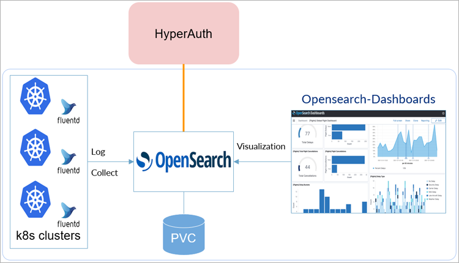
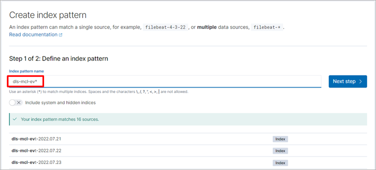
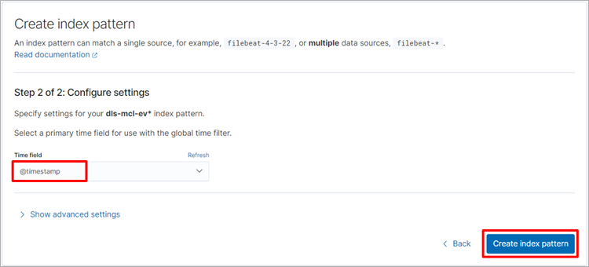
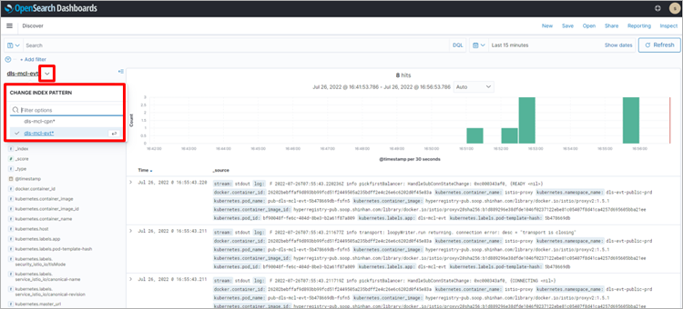
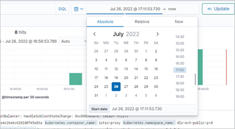
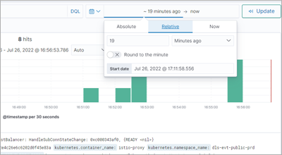
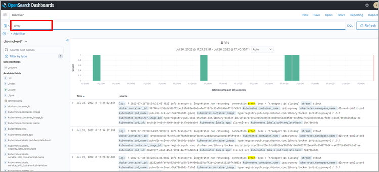
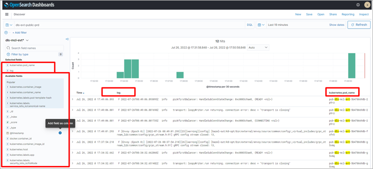

= OpenSearch
:toc:
:toc-title:

== OpenSearch 구조

HyperCloud를 구성하고 있는 노드에 데몬셋으로 생성되어 있는 fluentd를 통해 로그를 수집하여 OpenSearch에 저장한다. 이때 OpenSearch의 내용은 OpenSearch Dashboards를 통해 확인이 가능하다.

== Fluentd 설정

OpenSearch는 Fluentd를 통해 로그를 수집한다. 이때 Fluentd에서는 기본적으로 HyperCloud에서 동작하는 파드의 표준 출력(stdout) 로그를 하나의 인덱스 패턴(logstash*)으로 수집한다. 만약 이와 별도로 서비스 별 인덱스 패턴을 정의하고자 한다면 kube-logging 네임스페이스의 fluentd-config 컨피그맵에 정의해준다.

다음은 public 운영 환경의 fluentd-config 하단에 추가되어 있는 evt 로그 수집을 정의한 것으로, 내용은 노드의 /var/log/containers 아래의 dls-mcl-evt*.log 파일을 읽어 dls-mcl-evt-xxx 이름의 인덱스를 생성하는 것이다.
----
...중략...
<match kubernetes.var.log.containers.**dls-mcl-evt**.log>
      @type opensearch
      @log_level info
      request_timeout 2147483648
      include_tag_key true
      host "#{ENV['FLUENT_OPENSEARCH_HOST']}"
      port "#{ENV['FLUENT_OPENSEARCH_PORT']}"
      user "#{ENV['FLUENT_OPENSEARCH_USER']}"
      password "#{ENV['FLUENT_OPENSEARCH_PASSWORD']}"
      scheme "#{ENV['FLUENT_OPENSEARCH_SCHEME'] || 'https'}"
      ssl_verify "#{ENV['FLUENT_OPENSEARCH_SSL_VERIFY'] || 'false'}"
      ssl_version "#{ENV['FLUENT_OPENSEARCH_SSL_VERSION'] || 'TLSv1_2'}"
      reload_connections "#{ENV['FLUENT_OPENSEARCH_RELOAD_CONNECTIONS'] || 'false'}"
      reconnect_on_error "#{ENV['FLUENT_OPENSEARCH_RECONNECT_ON_ERROR'] || 'true'}"
      reload_on_failure "#{ENV['FLUENT_OPENSEARCH_RELOAD_ON_FAILURE'] || 'true'}"
      log_os_400_reason "#{ENV['FLUENT_OPENSEARCH_LOG_ES_400_REASON'] || 'false'}"
      logstash_prefix "#{ENV['FLUENT_ELASTICSEARCH_LOGSTASH_PREFIX'] || 'dls-mcl-evt'}"
      logstash_format "#{ENV['FLUENT_OPENSEARCH_LOGSTASH_FORMAT'] || 'true'}"
      index_name "#{ENV['FLUENT_ELASTICSEARCH_LOGSTASH_INDEX_NAME'] || 'dls-mcl-evt'}"
      enable_ilm true
    </match>
...중략...
----

== 인덱스 패턴 생성

OpenSearch Dashboards에서 비슷한 이름의 인덱스들을 패턴으로 정의하여 검색 범위를 한정하고, 이들의 라이프사이클 관리를 쉽게 하기 위해 인덱스 패턴을 생성한다.

. *메뉴 실행* +
OpenSearch Dashboards의 메뉴 영역에서 *[Management] > [Stack Management] > [Index Patterns]* 메뉴를 선택한 후 *[Create Index pattern]* 버튼을 클릭한다.

. *인덱스 패턴 이름 입력* +
인덱스 패턴 생성 화면의 "Step 1"에서 인덱스 패턴의 이름을 입력한 후 *[Next step]* 버튼을 클릭한다.
+

. *인덱스 패턴 타입 선택* +
인덱스 패턴 생성 화면의 "Step 2"에서 인덱스 패턴의 타입을 선택한 후 *[Create index pattern]* 버튼을 클릭한다.
+

. *생성 확인* +
OpenSearch Dashboards의 메뉴 영역에서 *[OpenSearch Dashboards] > [Discover]* 메뉴를 선택한다. +
Discover 메뉴 화면의 "CHANGE INDEX PATTERN" 항목에서 등록된 인덱스 패턴을 확인한다. 
+

== 로그 조회
OpenSearch Dashboards의 메뉴 영역에서 *[OpenSearch Dashboards] > [Discover]* 메뉴를 선택하면 수집된 로그의 내용을 확인할 수 있다.

=== 기간 설정
화면 오른쪽 상단의  영역에서 로그를 조회할 기간을 선택할 수 있다.

* 날짜 선택
+

* 시간 선택
+

=== 키워드 조회
화면 왼쪽 상단의 image:../../images/figure_keyword_icon.png[] 영역에 키워드를 입력하면 키워드가 포함된 로그 내용만 확인할 수 있다.

=== Available fields를 이용한 조회

Available fields를 선택하여 Selected fields에 추가한 후 조회를 하면 선택된 필드의 내용만 확인할 수 있다.

