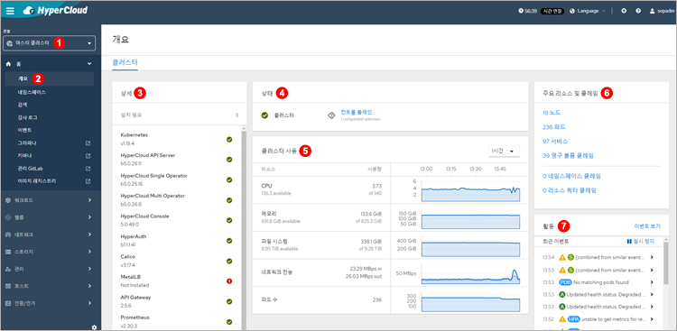

= 시스템 모니터링

시스템 모니터링을 통해 각 모듈의 상태 및 클러스터의 정보, 최근 이벤트 등에 대한 정보를 보다 쉽게 파악할 수 있다.

<1> "마스터 클러스터" 콘솔 선택
<2> *[홈] > [개요]* 메뉴 클릭
<3> *"상세"* 영역에서는 HyperCloud를 구성하고 있는 각 모듈의 설치 여부와 정상 작동 여부를 확인할 수 있다.
<4> *"상태"* 영역에서는 클러스터의 상태를 확인할 수 있다. 이때 **[컨트롤 플레인]**을 클릭하면 컨트롤 플레인의 각 컴포넌트의 응답률을 확인할 수 있다.
<5> *"클러스터 사용"* 영역에서는 현재 클러스터가 사용하고 있는 자원의 사용량을 확인할 수 있다.
<6> *"주요 리소스 및 클레임"* 영역에서는 현재 클러스터를 구성 중인 노드의 개수와 생성되어 있는 파드, 서비스, PVC의 수를 확인할 수 있고, 문제가 있는 파드나 PVC의 개수를 확인할 수 있다.
<7> *"활동"* 영역에서는 클러스터 내에서 발생하는 모든 이벤트 중 최근에 발생한 이벤트를 확인할 수 있다.
