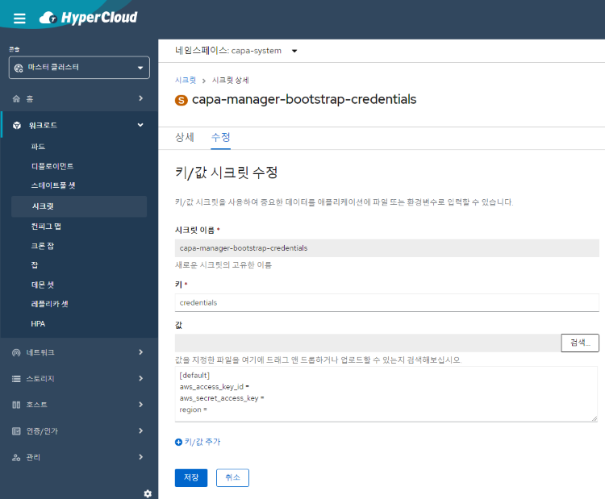

= 멀티 클러스터 계정 관리
:toc:
:toc-title:

== AWS 
AWS에 멀티 클러스터를 생성하기 위해 AWS 액세스 키 정보가 필요하다.

=== AWS 액세스 키 생성

AWS 액세스 키를 생성하는 방법은 AWS 사용 설명서를 참고한다. 

[NOTE]
.참고 문서
====
* link:https://docs.aws.amazon.com/ko_kr/IAM/latest/UserGuide/id_credentials_access-keys.html#Using_CreateAccessKey/[AWS 액세스 키 관리]
====

=== AWS 액세스 키 입력

AWS 액세스 키는 credentials로 관리된다. 
capa-system 네임스페이스의 capa-manager-bootstrap-credentials 시크릿에서 credentials의 값을 수정한다. 

+

. credentials 양식
----
[default]
aws_access_key_id = 
aws_secret_access_key = 
region = 
----
