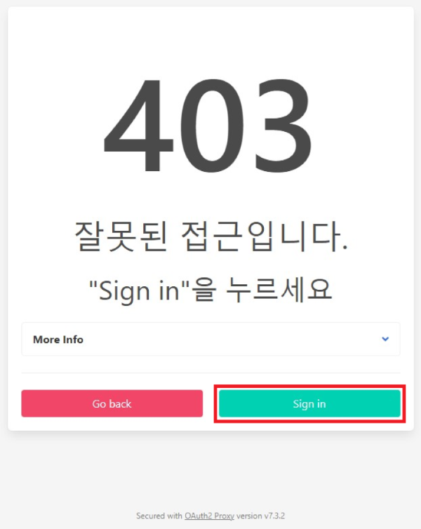
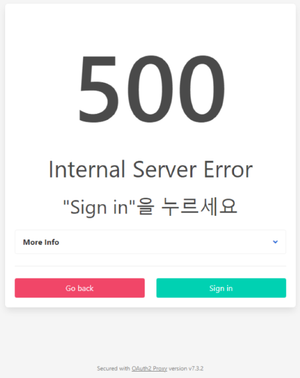

= oauth2-proxy 오류
:toc:
:toc-title:

== 403 오류

403 오류 발생 상황 및 조치 방법에 대한 설명은 다음과 같다.

* *상황*
+
Hypercloud 5.2 콘솔에 로그인 시 *csrf 쿠키*가 없는 경우 403 오류 페이지가 나타나는 상황이다. 
+

* *조치 방법*
+
*sing in* 버튼을 클릭하면 Hypercloud 5.2 콘솔로 이동한다. 
+

== 500 오류

500 오류 발생 상황 및 조치 방법에 대한 설명은 다음과 같다.

* *상황*
+
oauth2-proxy의 redis master, redis replicas 파드가 재기동됨으로 인해 oauth2-proxy 파드와 세션이 종료되어 500 오류 페이지가 나타나는 상황이다. 
+

* *조치 방법*
+ 
oauth2-proxy 파드를 재기동한다.
+
----
$ kubectl delete pod -n api-gateway-system oauth2-proxy
----
