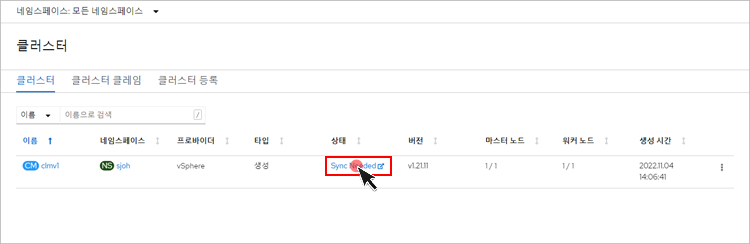
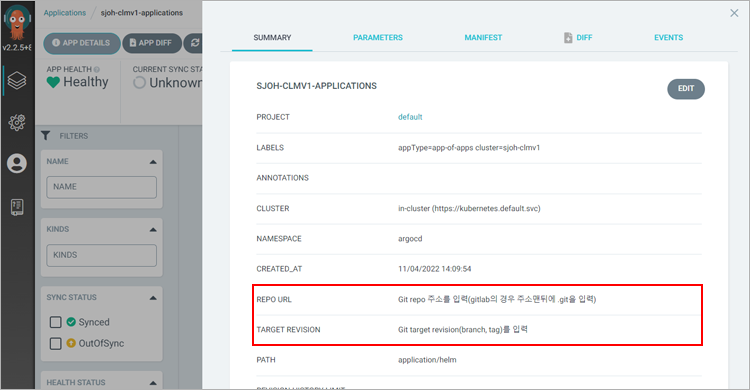
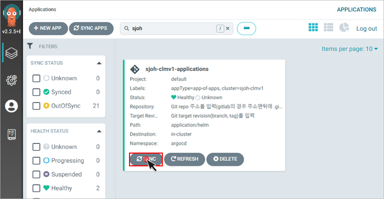
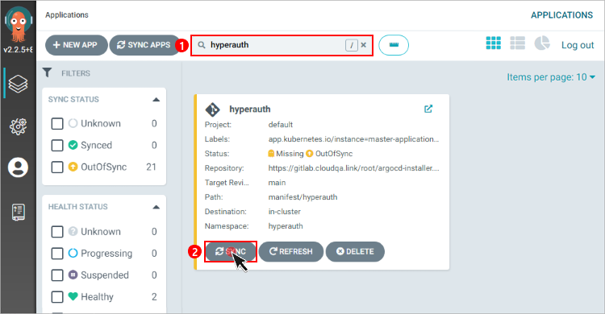
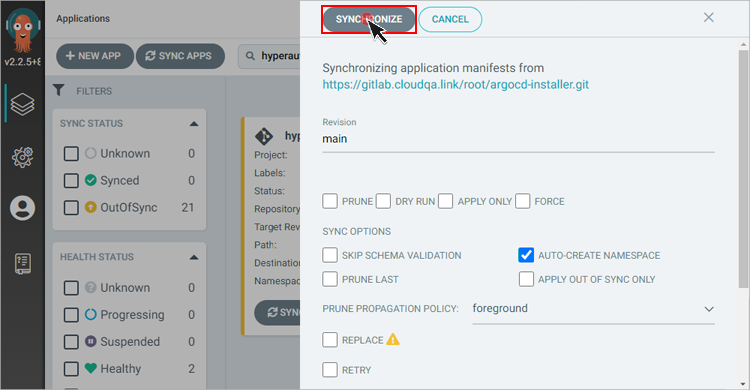
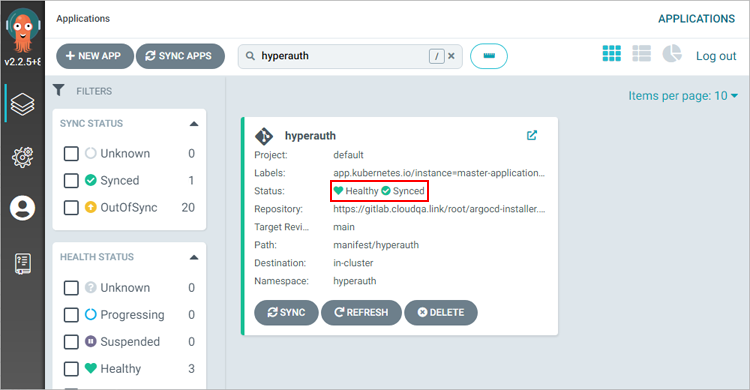

= 온프레미스 환경에서 구축

본 장에서는 온프레미스 환경에서 폐쇄망으로 Kubespray를 이용하여 HyperCloud를 설치하는 방법에 대해서 설명한다.

설치하는 과정은 크게 다음과 같다.

. <<K8sInfraOn, 쿠버네티스 인프라 구성>>
. <<ArgoCDInstallOn, ArgoCD 설치>>
. <<MasterClusterOn, 마스터 클러스터 설치>>
. <<SingleClusterOn, 싱글 클러스터 설치>>
. <<ResourceDeployOn, 리소스 배포>>

[#K8sInfraOn]
== 쿠버네티스 인프라 구성
본 절에서는 Kubespray를 이용하여 쿠버네티스 인프라를 구성하는 방법에 대해서 설명한다.

쿠버네티스 인프라를 구성하는 순서는 다음과 같다.

. <<KubesprayDecompressionK8sOn, Kubespray 파일 압축 해제>>
. <<KubesprayConfigK8sOn, Kubespray 환경 설정>>
. <<KubesprayRunK8sOn, Kubespray 실행>>

[#KubesprayDecompressionK8sOn]
=== Kubespray 파일 압축 해제

쿠버네티스 설치를 위해 테크넷을 통해서 다운로드한 *kubespray-infra.zip* 파일의 압축을 해제한다.

[#KubesprayConfigK8sOn]
=== Kubespray 환경 설정

Kubespray를 실행하기 위한 필수 설정 파일들을 정의한다.

NOTE: Kubespray를 실행하기 위해서는 사전 준비가 필요하다. 반드시  xref:offline-intro.adoc[설치 전 준비사항]을 참고하여 환경을 구성한다.

CAUTION: RHEL 운영체제일 경우 `kubespray-infra/cluster.yml` 파일을 열어 *- { role: bootstrap-os, tags: bootstrap-os}* 행을 반드시 주석 처리해야 한다.

. *노드 정보 등록*
+ 
`kubespray-infra/inventory/tmaxcloud/inventory.ini` 파일을 열어 kubespray에서 설치할 노드들의 정보를 등록한다. +
이때 all 그룹은 `*[호스트 이름] [Ansible IP 주소] [Backup IP 주소]*` 형태로 작성하고, 그 외 그룹은 all 그룹에서 정의한 호스트 이름만 작성한다.

. *쿠버네티스 기본 정보 설정*
+
`kubespray-infra/inventory/tmaxcloud/group_vars/all/all.yml` 파일을 열어 Kubernetes의 기본 정보를 설정한다.
+
.예시
----
apiserver_loadbalancer_domain_name: "10.0.10.50" <1> 
loadbalancer_apiserver:
  address: 10.0.10.50 <2>
  port: 6443 <3>
  
upstream_dns_servers: <4>
  - /etc/resolv.conf
----
+
<1> 쿠버네티스 API 서버 주소

* 싱글 마스터의 경우: 마스터 노드의 IP 주소
* 멀티 마스터의 경우: API 서버와 통신할 수 있는 VIP 주소 
<2> 쿠버네티스 API 서버와 통신할 수 있는 VIP 주소
<3> 쿠버네티스 API 서버 포트 번호
<4> 도메인 네임서버 주소 (필요시에만)

. *폐쇄망 정보 설정*
+
`kubespray-infra/inventory/tmaxcloud/group_vars/all/offline.yml` 파일을 열어 폐쇄망 관련 정보를 설정한다.
+
.예시
----
is_this_offline: true <1>
registry_host: "10.0.10.50:5000" <2>
files_repo: "http://172.22.5.2" <3>
----
+
<1> 폐쇄망 환경 여부 (폐쇄망일 경우 true)
<2> 프라이빗 레지스트리 주소
<3> 파일 리포지터리 주소

. *Calico 구성 정보 설정*
+
`kubespray-infra/inventory/tmaxcloud/group_vars/k8s_cluster/k8s-net-calico.yml` 파일을 열어 Calico 관련 정보를 설정한다.
+
.예시
----
calico_ip_auto_method: "cidr=192.168.7.0/24" <1>
----
+
<1> Calico가 자동으로 감지할 노드들의 CIDR 값 
+
vxlan mode 설정이 필요한 경우 아래 설정을 참고한다.
+
.예시
----
calico_ipv4pool_ipip: "Never"
calico_ipip_mode: "Never"
calico_vxlan_mode: "Always"
----

. *IP 주소 대역 설정*
+
`kubespray-infra/inventory/tmaxcloud/group_vars/k8s_cluster/k8s-cluster.yml` 파일을 열어 파드 및 서비스의 IP 주소 대역 정보를 설정한다.
+
.예시
----
# Kubernetes internal network for services, unused block of space.
kube_service_addresses: 10.96.0.0/24 <1>

# internal network. When used, it will assign IP
# addresses from this range to individual pods.
# This network must be unused in your network infrastructure!
kube_pods_subnet: 10.244.0.0/24 <2>
----
+
<1> 서비스 IP 주소 대역
<2> 파드 서브넷 IP 주소 대역

. *K8S 인증서 기한 설정*
+
`kubespray-infra/inventory/tmaxcloud/group_vars/k8s_cluster/k8s-cluster.yml` 파일을 열어 K8S의 인증서 기한을 설정한다. 
+
.예시
----
## k8s certs days
update_cert: true <1>
cert_days: 3650 <2>
----
+
<1> 인증서 기한 설정 활성화 (false인 경우 인증서의 기한은 1년입니다. )
<2> 인증서의 기한 (CA 인증서는 적용되지 않습니다. )

. *추가 설치 모듈 설정*
+
`kubespray-infra/inventory/tmaxcloud/group_vars/k8s_cluster/addons.yml` 파일을 열어 추가 설치가 가능한 모듈 관련 정보를 설정한다.
+
.예시
----
default_storageclass_name: nfs <1>
sc_name_0: nfs <2>
sc_name_999: nfs <3>
nfs_namespace: nfs <4>
nfs_server: 192.168.7.17 <5>
nfs_path: /root/test <6>
----
+
<1> 기본값으로 설정할 스토리지 이름
<2> HyperRegistry에서 Postgres PVC의 스토리지 클래스 이름
<3> 그 외의 PVC 스토리지 클래스 이름
<4> NFS 스토리지 네임스페이스 이름
<5> NFS 서버 주소  
<6> NFS 서버 공유 폴더 경로

[#KubesprayRunK8sOn]
=== Kubespray 실행

ansible-playbook 명령을 사용하여 Kubespray를 실행한다.
----
$ ansible-playbook -i inventory/tmaxcloud/inventory.ini --become --become-user=root cluster.yml
----

=== Kubespray Infra 삭제

Kubespray를 통해 구성한 k8s 리소스 전체 삭제 시 아래 내용을 참고한다.

master에 image registry를 구축했다면 reset시에 함께 삭제 되므로, 이후 클러스터 재설치시에는 image registry를 재구성 해야 한다.

*k8s 리소스 삭제*
----
$ ansible-playbook -i inventory/tmaxcloud/inventory.ini --become --become-user=root reset.yml
----

[#ArgoCDInstallOn]
== ArgoCD 설치
본 절에서는 Kubespray를 이용하여 ArgoCD를 설치하는 방법에 대해서 설명한다.

ArgoCD를 설치하는 순서는 다음과 같다.

. <<KubesprayDecompressionArgoOn, Kubespray 파일 압축 해제>>
. <<KubesprayConfigArgoOn, Kubespray 환경 설정>>
. <<KubesprayRunArgoOn, Kubespray 실행>>

[#KubesprayDecompressionArgoOn]
=== Kubespray 파일 압축 해제

ArgoCD 설치를 위해 테크넷을 통해서 다운로드한 *kubespray-onpremise.zip* 파일의 압축을 해제한다.

[#KubesprayConfigArgoOn]
=== Kubespray 환경 설정

Kubespray를 실행하기 위한 필수 설정 파일들을 정의한다.

CAUTION: RHEL 운영체제일 경우 `kubespray-onpremise/cluster.yml` 파일을 열어 *- { role: bootstrap-os, tags: bootstrap-os}* 행을 반드시 주석 처리해야 한다.

. *노드 정보 등록*
+ 
`kubespray-onpremise/inventory/tmaxcloud/inventory.ini` 파일을 열어 kubespray에서 설치할 노드들의 정보를 등록한다. + 
이때 all 그룹은 `*[호스트 이름] [Ansible IP 주소] [Backup IP 주소]*` 형태로 작성하고, 그 외 그룹은 all 그룹에서 정의한 호스트 이름만 작성한다.

. *폐쇄망 정보 설정*
+
`kubespray-onpremise/inventory/tmaxcloud/group_vars/all/offline.yml` 파일을 열어 폐쇄망 관련 정보를 설정한다.
+
.예시
----
is_this_offline: true <1>
registry_host: "10.0.10.50:5000" <2>
files_repo: "http://172.22.5.2" <3>
----
+
<1> 폐쇄망 환경 여부 (폐쇄망일 경우 true)
<2> 프라이빗 레지스트리 주소
<3> 파일 리포지터리 주소

. *사용자 지정 도메인 등록*
+
`kubespray-onpremise/inventory/tmaxcloud/group_vars/k8s_cluster/k8s-cluster.yml` 파일을 열어 외부에 노출할 사용자 지정 도메인의 정보를 등록한다.
+
.예시
----
# Enable extra custom DNS domain - by sophal_hong@tmax.co.kr
enable_local_nip_domain: false <1>
enable_custom_domain: true <2>
custom_domain_name: "cloudqa.com" <3>
custom_domain_ip: 172.22.7.2 <4>
api_server_dns_cfwhn: true <5>

# Kubernetes internal network for services, unused block of space.
kube_service_addresses: 10.96.0.0/24 <6>

# internal network. When used, it will assign IP
# addresses from this range to individual pods.
# This network must be unused in your network infrastructure!
kube_pods_subnet: 10.244.0.0/24 <7>
----
+
<1> nip.io 도메인의 사용 여부
<2> 커스텀 도메인의 사용 여부 (DNS를 사용할 경우 true)
<3> 프록시 노드에 맵핑된 DNS 이름
<4> 프록시 노드의 IP 주소 
<5> kube-apiserver의 DNS 정책으로 "ClusterFirstWithHostNet" 적용 여부 
<6> 서비스 IP 주소 대역
<7> 파드 서브넷 IP 주소 대역

. *설치할 애플리케이션 구성 정보 확인*
+
Kubespray로 설치될 애플리케이션(`nginx`, `hyperregistry`, `gitea`, `argocd`)의 구성 정보를 확인 및 설정한다. +
해당 애플리케이션의 구성 정보는 기본적으로 `kubespray-onpremise/roles/bootstrap-cloud/defaults/main.yml` 파일에서 설정이 가능하며, 추가적으로 커스터마이징이 필요할 경우에는 `kubespray-onpremise/roles/bootstrap-cloud/task/` 및 `kubespray-onpremise/roles/bootstrap-cloud/templates/` 하위 파일에서 설정이 가능하다.
+
hyperregistry는 기본 스토리지 클래스가 NFS이다. 만약 스토리지 클래스를 변경하려면 아래의 값을 변경한다.
+
.kubespray-onpremise/roles/bootstrap-cloud/defaults/main.yml
----
hyperregistry_storage_class: "nfs"
----

[#KubesprayRunArgoOn]
=== Kubespray 실행

ansible-playbook 명령을 사용하여 애플리케이션을 설치한다.
----
$ ansible-playbook -i inventory/tmaxcloud/inventory.ini --become --become-user=root cluster.yml -t bootstrap-cloud
----

애플리케이션 설치가 정상적으로 완료되면, Gitea과 ArgoCD 간의 저장소가 자동으로 연동된다.

CAUTION: Selfsigned 인증서로 Gitea를 설치했을 경우, kubespray-onpremise/roles/bootstrap-cloud/tasks/install-argocd.yml 에서 Gitea 주소를 적용하는 task 주석을 제거한다.
----
- name: ArgoCD | Apply Secret for self-signed Gitea
  ansible.builtin.shell: |
    sudo chmod +755 ./argocd-apply-gitea-repo-secret.sh
    sudo ./argocd-apply-gitea-repo-secret.sh
  args:
    chdir: "{{ kube_config_dir }}/addons/argocd"
  ignore_errors: true
----
====

====
[#MasterClusterOn]
== 마스터 클러스터 설치

. *master-values.yaml 파일 gateway 수정*
+
`kubespray-onpremise/roles/bootstrap-cloud/templates/argocd_installer/application/helm/master-values.yaml` 파일을 열어 gateway 설정, 각 앱들의 사용 여부, 로그 레벨 및 세부 환경 변수를 정의한다.
+
.예시
----
...
  gatewayBootstrap:
    enabled: true
    ...
    service:
      type: LoadBalancer <1>
    tls:
      selfsigned:
        enabled: true <2>
      acme:
        enabled: false <3>
        email: test@tmax.co.kr
        dns:
          type: route53
          accessKeyID: accesskey <4>
          accessKeySecret: secretkey <5>
          hostedZoneID: hostedzoneid <6>
        environment: production <7>
----
<1> 네트워크 서비스 타입
* LoadBalancer
* NodePort
<2> 자체 서명 인증서의 사용 여부
<3> Route 53으로 생성한 도메인을 사용하기 위한 자동 인증서 관리 환경 사용 여부
<4> AWS에서 사용하는 계정의 액세스 키 ID
<5> 액세스 키 ID에 대한 시크릿 키
<6> Route 53으로 생성한 도메인에 대한 호스팅 영역 ID
<7> 실제 사용할 인증서 발급 용도
* 운영용 : production
* 테스트용 : staging
+
. *멀티클러스터를 사용할 경우 master-values.yaml 파일 cluster-api 수정*
+
.예시
----
### cluster-api
  capi:
    ...
    providers:
      aws:
        enabled: true <1>
        credentials:
          accessKeyID: access-key <2>
          secretAccessKeyID: secret-access-key <3>
      ...
      vsphere:
        enabled: true <4>
        credentials:
          username: "user" <5>
          password: "password" <6>
----
<1> capa 설치 여부
<2> 멀티클러스터용 AWS에서 사용하는 계정의 액세스 키 ID
<3> 액세스 키 ID에 대한 시크릿 키
<4> capv 설치 여부
<5> vcenter ID
<6> vcenter Password

+
NOTE: 예시 외에 설치할 모듈에 대한 enabled 값을 true로 설정하거나, 필요시 서브 도메인을 등록한다.

. *애플리케이션 변수 설정*
+
`kubespray-onpremise/roles/bootstrap-cloud/templates/argocd_installer/application/app_of_apps/master-applications.yaml` 파일을 열어 마스터 클러스터의 애플리케이션 변수를 설정한다.
+
.예시
----
source:
      ...
      parameters:
        - name: global.domain
          value: "글로벌 도메인을 입력하세요 ex) testdomain.com" <1>
        - name: global.masterSingle.hyperAuthDomain
          value: "hyperauth full 도메인을 입력하세요 ex) hyperauth.testdomain.com" <2>
        # Avaliable values: UTC, Asia/Seoul
        - name: global.timeZone
          value: "UTC" <3>
        - name: global.network.disabled
          value: "true" <4>
        - name: global.privateRegistry
          value: "폐쇄망일 경우 image registry 주소를 입력하세요 ex) https://hyperregistry.testdomain.com" <5>
        - name: spec.source.repoURL
          value: "git repository URL을 입력하세요 ex) https://github.com/tmax-cloud/argocd-installer.git" <6>
        - name: spec.source.targetRevision
          value: "target Revision을 입력하세요 ex) main" <7>
    path: application/helm
    # 환경에 맞게 url 주소 변경 필요
    repoURL: https://github.com/tmax-cloud/argocd-installer <8>
    # 환경에 맞게 target branch/release 변경 필요
    targetRevision: HEAD <9>
----
<1> 애플리케이션 설치 시 인그레스 주소에 사용될 커스텀 도메인 이름
<2> 마스터 클러스터와 싱글 클러스터에서 사용할 HyperAuth 주소
<3> 애플리케이션 타임존 설정 
* UTC
* Asia/Seoul
<4> 폐쇄망 환경 여부 (폐쇄망일 경우 true)
<5> 프라이빗 컨테이너 이미지 레지스트리의 주소
<6> 최상위 변수용 ArgoCD와 연동된 Gitea 저장소 주소 (Gitea의 경우 URL 마지막에 .git을 추가)
<7> 최상위 변수용 Gitea에 연동되어 있는 argocd-installer의 브랜치 이름
<8> master-applications.yaml용 ArgoCD와 연동된 Gitea 저장소 주소 (Gitea의 경우 URL 마지막에 .git을 추가)
<9> master-applications.yaml용 Gitea에 연동되어 있는 argocd-installer의 브랜치 이름

. *Gitea 동기화 작업*
+
ArgoCD와 연동된 Gitea의 argocd-installer 브랜치에서 `master-values.yaml`, `master-applications.yaml` 파일을 열어 위의 1~3번 과정과 동일하게 환경 변수를 설정한다.

. *애플리케이션 등록*
+
설치 환경에 애플리케이션을 등록한다.
+
----
$ kubectl -n argocd apply -f application/app_of_apps/master-applications.yaml
----

[#SingleClusterOn]
== 싱글 클러스터 설치

. *생성된 애플리케이션 파일 불러오기*
+
HyperCloud 웹 콘솔의 "멀티 클러스터" 콘솔에서 *[클러스터]* 메뉴를 클릭하면 싱글 클러스터 목록이 조회된다. 이때 싱글 클러스터 상태가 "Sync Needed"로 변경되면 해당 상태를 클릭한다.
+

. *애플리케이션 변수 설정*
+
싱글 클러스터의 애플리케이션 동기화 옵션 설정 화면이 열리면 "REPO URL"과 "TARGET REVISION" 항목을 설정한다.
+

+
설정 완료 후 애플리케이션의 *[SYNC]* 버튼을 클릭한다
+

CAUTION: 클러스터 클레임으로 생성한 클러스터를 배포할 경우 대시보드를 통한 리소스 사용량 조회가 일부 지원되지 않는다.

[#ResourceDeployOn]
== 리소스 배포

애플리케이션 동기화 작업을 통해 리소스를 배포한다.

이때 마스터 클러스터와 싱글 클러스터에서 각각 동기화 작업을 진행해야 하며, 각 애플리케이션의 동기화 순서는 아래를 참고한다.

[CAUTION]
.마스터 클러스터 동기화 순서
====
마스터 클러스터에서 애플리케이션 동기화 순서는 다음과 같다. 반드시 순서에 맞게 동기화 작업을 수행한다. +
1. cert-manager + api-gateway with console) +
2. strimzi-kafka-operator + hyperauth +
3. oauth2-proxy +
4. gitea, argocd, hyperregistry +
5. loki +
6. prometheus +
7. grafana-operator +
8. service-mesh(istio, jaeger, kiali) +
9. hypercloud +
10. template-service-broker +
11. catalog-controller +
12. cicd-operator(tekton) +
13. ai-devops + 
14. cluster-api(aws, vsphere) +
15. redis-operator, helm-apiserver, service-binding-operator +
16. sonarqube, nexus +
17. image-validating-webhook
====

[CAUTION]
.싱글 클러스터 동기화 순서
====
싱글 클러스터에서 애플리케이션 동기화 순서는 다음과 같다. 반드시 순서에 맞게 동기화 작업을 수행한다. +
1. cert-manager + api-gateway + oauth2-proxy without console) +
2. loki +
3. prometheus +
4. grafana-operator +
5. hyperregistry +
6. service-mesh(istio, jaeger, kiali) + 
7. template-service-broker +
8. catalog-controller, cicd-operator(tekton), redis-operator, helm-apiserver, service-binding-operator +
9. ai-devops, sonarqube, nexus +
10. image-validating-webhook
====

. *ArgoCD 콘솔 접속*
+
웹 브라우저의 주소 표시줄에 ArgoCD 서버의 주소를 입력한다.
+
[NOTE]
====
ArgoCD 서버 주소는 다음의 명령을 실행하여 확인할 수 있다.
----
$ kubectl get ingress -n argocd
----
====

. *ArgoCD 콘솔 로그인*
+
ArgoCD 콘솔 로그인 화면이 열리면 계정 아이디와 비밀번호를 입력한 후 *[SIGN IN]* 버튼을 클릭한다.
+
[NOTE]
====
ArgoCD 계정 아이디 및 초기 비밀번호 정보는 다음의 명령을 실행하여 확인할 수 있다.
----
$ kubectl -n argocd get secret argocd-initial-admin-secret -o jsonpath="{.data.password}" | base64 -d; echo
----
ArgoCD 콘솔에 첫 로그인 시 위에서 확인한 계정 정보로 로그인이 가능하며, 로그인 후 *[User Info]* 메뉴를 통해 비밀번호를 변경할 수 있다.
====

. *동기화할 애플리케이션 검색*
+
동기화 작업을 수행할 애플리케이션을 검색한 후 *[SYNC]* 버튼을 클릭한다.
+

. *동기화 옵션 설정*
+
동기화할 리소스 및 동기화 옵션을 설정한 후 *[SYNCHRONIZE]* 버튼을 클릭한다.
+

. *상태 확인*
+
애플리케이션의 *Status* 항목에 "Healthy"와 "Synced"가 표시되는지 확인한다.
+

