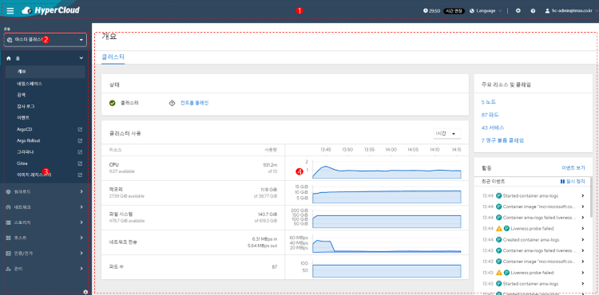

= 메인 화면 구성

HyperCloud 콘솔의 메인 화면은 다음과 같이 구성된다.

각 영역에 대한 설명은 다음과 같다.

<1> *작업표시줄 영역* +
현재 로그인된 사용자 계정의 이름과 세션 유효 시간 정보를 확인할 수 있다.

<2> *콘솔 종류 선택 영역*  +
HyperCloud 콘솔에서는 기본적으로 2가지 종류의 콘솔을 제공한다.
+
[width="100%",options="header", cols="2,3"]
|====================
|콘솔 종류|설명  
|마스터 클러스터|HyperCloud 클러스터 리소스들을 관리하기 위한 콘솔
|개발자|개발자가 각 서비스에 대한 요청 로직을 구성하기 위한 콘솔
|====================

<3> *메뉴 영역* +
선택한 콘솔 종류에서 제공하는 메인 메뉴를 확인할 수 있다. +
콘솔 종류에 따라 제공하는 메인 메뉴는 다음과 같다.
+
[width="100%",options="header", cols="2,3"]
|====================
|콘솔 종류|메인 메뉴
|마스터 클러스터|홈 +
워크로드 +
네트워크 +
스토리지 +
호스트 +
인증/인가 +
관리
|개발자|토폴로지 +
서비스 카탈로그 +
서비스 메시 +
CI/CD 
|====================

<4> *실행 화면 영역* +
메뉴 영역에서 선택한 메뉴에 해당하는 정보를 확인 및 설정할 수 있다.
